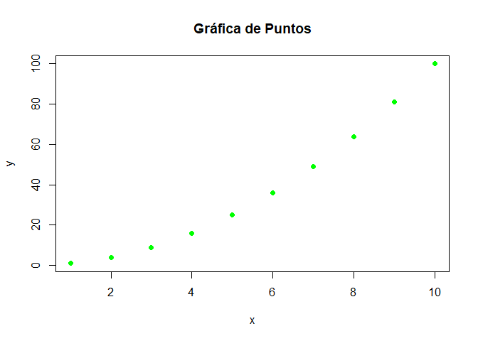
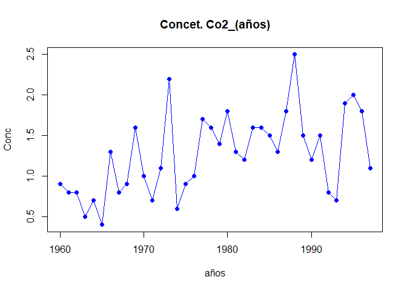
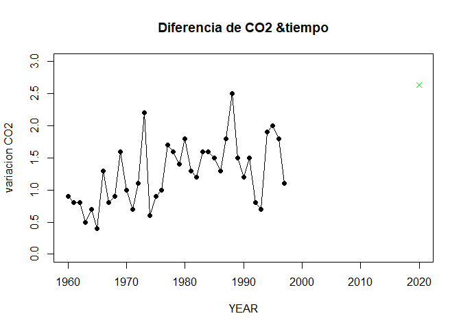
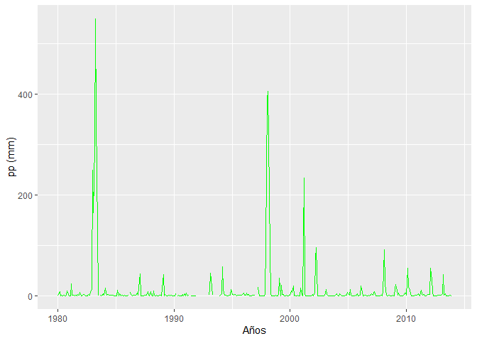
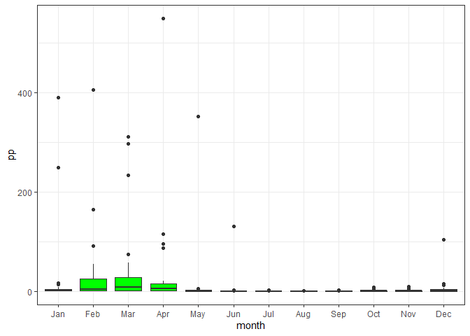

6 EJERCICIO
================

### INTEGRANTES

Baca Quiñonez, Pedro (17160038)

Cosios Leona, Jose (17160182)

Esquivel Guillermo, Antoni (17160183)

Garro Doroteo, Jamir (17160185)

Rivera Reaño, Ricardo (17160037)

### EJERCICIOS PARTE 1

***Antes tenemos que cargar las librerias que utilizaremos***

``` r
library(tidyverse)
library(magrittr)
library(pacman)
library(dplyr)
```

***1.1.Calcula los valores numéricos aproximados de***

``` r
#a.
(0.3*0.15)/((0.3*0.15)+(0.2*0.8)+(0.5*0.12)) 
```

    ## [1] 0.1698113

``` r
#b.
(5^6 / factorial(6)) * (exp(1))^(-5)
```

    ## [1] 0.1462228

``` r
#c.
combinatoria <- factorial(20) / (factorial(7) * (factorial(20-7)))
potencia <- (0.4^7)*(0.6^13)
(resultado <- combinatoria * potencia)
```

    ## [1] 0.1658823

***1.2.Realizar las siguientes sumas***

a . 1 + 2 + 3 + ……. + 1000

``` r
suma01 <- c(0:1000)
sum(suma01)
```

    ## [1] 500500

b . 1 + 2 + 4 + 8 + 16 + ….. + 1024

``` r
i <- NULL; aux <- NULL; r <- NULL
for (i in 0:10) {
  aux <- 2^i; r <- c(r, aux)}
sum(r)
```

    ## [1] 2047

***1.3 .El vector grupo representa el grupo al que pertenece una serie
de alumnos***

a . ¿Cuántos elementos tiene?

*primero cargamos el archivo*

``` r
load("ei1012-1516-la-s1-datos.Rdata")
```

*convertimos a data frame*

``` r
dfclase <- data.frame(grupo, nota)
head(dfclase)
```

    ##   grupo nota
    ## 1     B  4.9
    ## 2     A  5.4
    ## 3     E  5.2
    ## 4     D  6.8
    ## 5     B  5.0
    ## 6     D  6.2

*obeservamos la cantidad de elementos que tiene con length*

``` r
length(dfclase$grupo)
```

    ## [1] 192

b . ¿En que posiciones del vector está la letra “A”?

*Obervamos la posición con la función “which”*

``` r
which(dfclase$grupo == "A")
```

    ##  [1]   2   8  17  21  28  84 101 108 111 115 123 136 190 192

***1.4. El vector nota representa la nota de un examen de los alumnos
que están en los grupos del vector grupo.***

a . ¿Cuanto suman todas las notas?

``` r
sum(dfclase$nota)
```

    ## [1] 962

b . ¿Cual es la media aritmética de todas las notas?

``` r
mean(dfclase$nota)
```

    ## [1] 5.010417

c . ¿En qué posiciones están las notas mayores de 7.0?

``` r
which(dfclase$nota > 7)
```

    ## [1]  81 103 120 151

d . Visualiza las notas ordenadas de mayor a menor

``` r
Notdec <- sort(dfclase$nota,decreasing = TRUE)
head(Notdec)
```

    ## [1] 7.7 7.5 7.4 7.2 7.0 6.9

e . ¿En qué posición está la nota máxima?

``` r
which.max(dfclase$nota)
```

    ## [1] 120

***1.5. A partir de los vectores grupo y nota definidos.***

a . Suma las notas de los 10 primeros alumnos del vector

``` r
notas10p <- dfclase$nota[1:10]
sum(notas10p)
```

    ## [1] 51.8

b . ¿Cuántos alumnos hay del grupo C?

``` r
grupoc <- dplyr::filter(dfclase, dfclase$grupo == "C")
length(grupoc$grupo)
```

    ## [1] 39

c . ¿Cuántos alumnos han aprobado?

``` r
aprobados <- dplyr::filter(dfclase, dfclase$nota >= 5.5)
length(aprobados$nota)
```

    ## [1] 73

d . ¿Cuántos alumnos del grupo B han aprobado?

``` r
GrupoB <- dplyr::filter(aprobados, aprobados$grupo == "B")
length(GrupoB$nota)
```

    ## [1] 9

e . ¿Qué porcentaje de alumnos del grupo C han aprobado?

``` r
AprobadosC <- dplyr::filter(aprobados, aprobados$grupo == "C")
(length(AprobadosC$nota)/length(dfclase$grupo))*100
```

    ## [1] 10.41667

f . ¿De qué grupos son la máxima y mínima notas de toda la muestra?

``` r
max(dfclase$nota)
```

    ## [1] 7.7

g . Nota media de los alumnos de grupo A y B, juntos, considerando sólo
a los que han aprobado.

``` r
aprobadosAB <- dplyr::filter(aprobados, aprobados$grupo == "A" | 
                               aprobados$grupo == "B")
mean(aprobadosAB$nota)
```

    ## [1] 6.109091

***1.6. Calcula el percentil 66 de las notas de todos los alumnos, y
también de los alumnos del grupo C.***

1.  Percentil de todos los alumnos

``` r
percentil <- quantile(dfclase$nota, 66/100)
percentil
```

    ## 66% 
    ## 5.5

2.  Percentil de todos los alumnos del grupo C

``` r
per66C <- quantile(grupoc$nota, 66/100)
per66C
```

    ##   66% 
    ## 5.808

***1.7. Un alumno tiene una nota de 4.9. ¿Qué porcentaje, del total de
alumnos, tiene una nota menor o igual que la suya? ¿Y qué porcentaje
tiene una nota mayor o igual que la suya?***

a . porcentaje de alummnos que tiene nota menor o igual a 4.9

``` r
menor4.9 <- dplyr::filter(dfclase, dfclase$nota <= 4.9)
(length(menor4.9$nota)/length(dfclase$nota))*100
```

    ## [1] 46.875

b . porcentaje de alummnos que tiene nota mayor o igual a 4.9

``` r
mayor4.9 <- dplyr::filter(dfclase, dfclase$nota >= 4.9)
(length(mayor4.9$nota)/length(dfclase$nota))*100
```

    ## [1] 56.25

***1.8. Realiza el gráfico de diagramas de caja de las notas de cada
grupo, para poder comparar el nivel de cada uno de ellos.***

``` r
boxplot(`nota` ~ `grupo`, dfclase, col = palette(rainbow(2)))
```

<!-- -->

***1.9. Si la variable conc recoge la concentración de plomo (en ppm) en
el aire de cierta zona durante un día completo***

a . ¿Cuál ha sido la concentración máxima?

``` r
max(conc)
```

    ## [1] 47.34

b . ¿En cuántos de los muestreos se ha superado la concentración de 40.0
ppm?

``` r
mayor40 <- conc[conc > 40]
length(mayor40)
```

    ## [1] 61

c . ¿Cuál ha sido la concentración media del día?

``` r
mean(conc)
```

    ## [1] 24.07229

d . ¿Cuáles fueron las 10 mediciones más bajas del día?

``` r
ascendentecon <- sort(conc)
ascendentecon[1:10]
```

    ##  [1] 0.93 1.07 1.77 2.03 2.58 2.73 2.75 2.88 2.88 2.91

### EJERCICIOS PARTE 2

***2.1. Graficar los puntos
(1,1),(2,4),(3,6),(4,8),(5,25),(6,36),(7,49),(8,61),(9,81),(10,100) en
un plano utilizando RStudio***

``` r
x<-c(1,2,3,4,5,6,7,8,9,10)
y<-c(1,4,9,16,25,36,49,64,81,100)
plot(x,y, main = "Gráfica de Puntos", col = "green", pch = 16,)
```

<!-- -->

***2.2 Ingresar la matriz A en RStudio***

``` r
(A <- matrix(c(1:4, seq(2,8,by = 2),seq(3,12,by = 3)), nrow = 4, ncol = 3))
```

    ##      [,1] [,2] [,3]
    ## [1,]    1    2    3
    ## [2,]    2    4    6
    ## [3,]    3    6    9
    ## [4,]    4    8   12

***2.3 Ingresar la matriz identidad de tamaño 3***

``` r
diag(3)
```

    ##      [,1] [,2] [,3]
    ## [1,]    1    0    0
    ## [2,]    0    1    0
    ## [3,]    0    0    1

***2.4 Crea una función que cree una matriz nula ingresando las
dimensiones***

``` r
matriz_nula <- function(filas,columnas){ 
  matrix(0 , nrow = filas ,ncol = columnas) 
}
matriz_nula(2,3)
```

    ##      [,1] [,2] [,3]
    ## [1,]    0    0    0
    ## [2,]    0    0    0

``` r
matriz_nula(5,5)
```

    ##      [,1] [,2] [,3] [,4] [,5]
    ## [1,]    0    0    0    0    0
    ## [2,]    0    0    0    0    0
    ## [3,]    0    0    0    0    0
    ## [4,]    0    0    0    0    0
    ## [5,]    0    0    0    0    0

``` r
matriz_nula(2,6)
```

    ##      [,1] [,2] [,3] [,4] [,5] [,6]
    ## [1,]    0    0    0    0    0    0
    ## [2,]    0    0    0    0    0    0

***2.5 Modificar la matriz diag(4), para que se parezca a la matriz B***

``` r
B<-diag(4)
B[1,1]=0
B[2,2]=2
B[3,3]=3
B[4,4]=4
B
```

    ##      [,1] [,2] [,3] [,4]
    ## [1,]    0    0    0    0
    ## [2,]    0    2    0    0
    ## [3,]    0    0    3    0
    ## [4,]    0    0    0    4

***2.6 Obtener la matriz transpuesta de A (ejercicio 2)***

``` r
(Transpuesta_A <- t(A))
```

    ##      [,1] [,2] [,3] [,4]
    ## [1,]    1    2    3    4
    ## [2,]    2    4    6    8
    ## [3,]    3    6    9   12

***2.7 Realizar las siguientes operaciones A+B, A−B, 3B y AB***

``` r
A <- c(1, 2, 3, 2, 4, 6, 3, 6, 9, 4, 8, 12)
Z <- c(0)
matrizA <- matrix(A, nrow = 4, ncol = 3, byrow = T)
matrizA
```

    ##      [,1] [,2] [,3]
    ## [1,]    1    2    3
    ## [2,]    2    4    6
    ## [3,]    3    6    9
    ## [4,]    4    8   12

``` r
matrizZ <- matrix(Z, nrow = 4, ncol = 1, byrow = T)
matrizW <- cbind(matrizA, matrizZ)
matrizW
```

    ##      [,1] [,2] [,3] [,4]
    ## [1,]    1    2    3    0
    ## [2,]    2    4    6    0
    ## [3,]    3    6    9    0
    ## [4,]    4    8   12    0

``` r
Y <- c(-1, 0, 0, 0, 0, 1, 0, 0, 0, 0, 2, 0, 0, 0, 0, 3)
matrizY <- matrix(Y, nrow = 4, ncol = 4, byrow = T)
matrizY
```

    ##      [,1] [,2] [,3] [,4]
    ## [1,]   -1    0    0    0
    ## [2,]    0    1    0    0
    ## [3,]    0    0    2    0
    ## [4,]    0    0    0    3

``` r
X <- diag(4)
suma <- function(X, matrizY){ 
  B <- X + matrizY
  return(B)
}
suma(X, matrizY)
```

    ##      [,1] [,2] [,3] [,4]
    ## [1,]    0    0    0    0
    ## [2,]    0    2    0    0
    ## [3,]    0    0    3    0
    ## [4,]    0    0    0    4

``` r
B <- X + matrizY
B
```

    ##      [,1] [,2] [,3] [,4]
    ## [1,]    0    0    0    0
    ## [2,]    0    2    0    0
    ## [3,]    0    0    3    0
    ## [4,]    0    0    0    4

``` r
# W + B
suma01 <- function(W, B){ 
  resultado01 <- W + B
  return(resultado01)
}
suma01(matrizW, B)
```

    ##      [,1] [,2] [,3] [,4]
    ## [1,]    1    2    3    0
    ## [2,]    2    6    6    0
    ## [3,]    3    6   12    0
    ## [4,]    4    8   12    4

``` r
# W - B
resta02 <- function(W, B){ 
  resultado02 <- W - B
  return(resultado02)
}
resta02(matrizW, B)
```

    ##      [,1] [,2] [,3] [,4]
    ## [1,]    1    2    3    0
    ## [2,]    2    2    6    0
    ## [3,]    3    6    6    0
    ## [4,]    4    8   12   -4

``` r
# 3*B
multiplicacion03 <- function(B){ 
  resultado03 <- 3*B
  return(resultado03)
}
multiplicacion03(B)
```

    ##      [,1] [,2] [,3] [,4]
    ## [1,]    0    0    0    0
    ## [2,]    0    6    0    0
    ## [3,]    0    0    9    0
    ## [4,]    0    0    0   12

``` r
# W*B
multiplicacion04 <- function(W,B){ 
  resultado04 <- W%*%B
  return(resultado04)
}
multiplicacion04(matrizW, B)
```

    ##      [,1] [,2] [,3] [,4]
    ## [1,]    0    4    9    0
    ## [2,]    0    8   18    0
    ## [3,]    0   12   27    0
    ## [4,]    0   16   36    0

***2.8 Crea una función para calcular P^6***

``` r
# MATRIZ P
(P<-matrix(c(1,-2,1,2,4,0,3,-2,1), ncol=3, nrow=3))
```

    ##      [,1] [,2] [,3]
    ## [1,]    1    2    3
    ## [2,]   -2    4   -2
    ## [3,]    1    0    1

``` r
 P%*%P%*%P%*%P%*%P%*%P
```

    ##       [,1]  [,2]  [,3]
    ## [1,] -1792    24 -2824
    ## [2,]  -464 -2416 -1344
    ## [3,]  -648   440  -912

``` r
# Función
 # n es la potencia
x <- function(P,n){
  if(dim(P)[2]==dim(P)[1]){
    aux <- P
    j <- 1
    repeat{
      P <- P%*%aux
      j <- j+1
      if(j==n)(break)
    }
    P
  }
}

#Consulta
x(P,6)
```

    ##       [,1]  [,2]  [,3]
    ## [1,] -1792    24 -2824
    ## [2,]  -464 -2416 -1344
    ## [3,]  -648   440  -912

***2.9 Resolver el sistema de ecuaciones:*** 3x - y + z = -1; 9x - 2y +
z = -9; 3x + y -2z = -9

``` r
T.D <- matrix(c(3,9,3,-1,-2,1,1,1,-2), ncol=3,nrow=3)
T.I <- c(-1,-9,-9)
Solución <- solve(T.D,T.I)
names(Solución) <- c("x","y","z")
Solución
```

    ##  x  y  z 
    ## -1  2  4

***2.10 Utilizando la ayuda de R, investigue para que sirven las
funciones eigen() y det()***

*La función eigen() sirve para calcular valores y vectores propios de
una matriz. Esos vectores propios o eigen vectores son los que despues
de ser multiplicados por una matriz cuadrada modifican su magnitud pero
no su dirección,asi mismo los eigen valores cambian los valores de los
eigen vectores.* *La función det() permite calcular el determinante de
una matriz cuadrada.* *Ejemplo:*

``` r
(M<- matrix(24:39, nrow=4, ncol=4))
```

    ##      [,1] [,2] [,3] [,4]
    ## [1,]   24   28   32   36
    ## [2,]   25   29   33   37
    ## [3,]   26   30   34   38
    ## [4,]   27   31   35   39

``` r
(eigen(M))
```

    ## eigen() decomposition
    ## $values
    ## [1]  1.266318e+02 -6.317531e-01 -3.585516e-15 -8.269738e-16
    ## 
    ## $vectors
    ##            [,1]       [,2]       [,3]        [,4]
    ## [1,] -0.4760125  0.7341634  0.1359768 -0.05222797
    ## [2,] -0.4917965  0.2913463  0.2141652  0.47602534
    ## [3,] -0.5075805 -0.1514708 -0.8362608 -0.79536677
    ## [4,] -0.5233645 -0.5942879  0.4861188  0.37156940

``` r
(det(M))
```

    ## [1] 1.490947e-28

***2.11 Considerando las matrices***

``` r
(B <- matrix(c(1:10, seq(2,20,by = 2),seq(3,30,by = 3),seq(4,40,by = 4),
              seq(5,50,by = 5)) , nrow = 10, ncol = 5))
```

    ##       [,1] [,2] [,3] [,4] [,5]
    ##  [1,]    1    2    3    4    5
    ##  [2,]    2    4    6    8   10
    ##  [3,]    3    6    9   12   15
    ##  [4,]    4    8   12   16   20
    ##  [5,]    5   10   15   20   25
    ##  [6,]    6   12   18   24   30
    ##  [7,]    7   14   21   28   35
    ##  [8,]    8   16   24   32   40
    ##  [9,]    9   18   27   36   45
    ## [10,]   10   20   30   40   50

``` r
dim(B)
```

    ## [1] 10  5

``` r
(A <- matrix(c(rep(0:1, 7),rep(c(0,0,1), 2),c(1,0,1,1,0)), 
            nrow = 5, ncol = 5, byrow = T))
```

    ##      [,1] [,2] [,3] [,4] [,5]
    ## [1,]    0    1    0    1    0
    ## [2,]    1    0    1    0    1
    ## [3,]    0    1    0    1    0
    ## [4,]    0    1    0    0    1
    ## [5,]    1    0    1    1    0

``` r
dim(A)
```

    ## [1] 5 5

``` r
#B.A
(BA <- B%*%A)#10x5
```

    ##       [,1] [,2] [,3] [,4] [,5]
    ##  [1,]    7    8    7    9    6
    ##  [2,]   14   16   14   18   12
    ##  [3,]   21   24   21   27   18
    ##  [4,]   28   32   28   36   24
    ##  [5,]   35   40   35   45   30
    ##  [6,]   42   48   42   54   36
    ##  [7,]   49   56   49   63   42
    ##  [8,]   56   64   56   72   48
    ##  [9,]   63   72   63   81   54
    ## [10,]   70   80   70   90   60

``` r
#TRANSPUESTA DE B 
transpuestaB <- t(B)
transpuestaB #5x10 
```

    ##      [,1] [,2] [,3] [,4] [,5] [,6] [,7] [,8] [,9] [,10]
    ## [1,]    1    2    3    4    5    6    7    8    9    10
    ## [2,]    2    4    6    8   10   12   14   16   18    20
    ## [3,]    3    6    9   12   15   18   21   24   27    30
    ## [4,]    4    8   12   16   20   24   28   32   36    40
    ## [5,]    5   10   15   20   25   30   35   40   45    50

``` r
#A*BT
(resultadoABT <- A%*%transpuestaB)
```

    ##      [,1] [,2] [,3] [,4] [,5] [,6] [,7] [,8] [,9] [,10]
    ## [1,]    6   12   18   24   30   36   42   48   54    60
    ## [2,]    9   18   27   36   45   54   63   72   81    90
    ## [3,]    6   12   18   24   30   36   42   48   54    60
    ## [4,]    7   14   21   28   35   42   49   56   63    70
    ## [5,]    8   16   24   32   40   48   56   64   72    80

``` r
t(resultadoABT)
```

    ##       [,1] [,2] [,3] [,4] [,5]
    ##  [1,]    6    9    6    7    8
    ##  [2,]   12   18   12   14   16
    ##  [3,]   18   27   18   21   24
    ##  [4,]   24   36   24   28   32
    ##  [5,]   30   45   30   35   40
    ##  [6,]   36   54   36   42   48
    ##  [7,]   42   63   42   49   56
    ##  [8,]   48   72   48   56   64
    ##  [9,]   54   81   54   63   72
    ## [10,]   60   90   60   70   80

``` r
#AB - A*BT
(BA - t(resultadoABT))
```

    ##       [,1] [,2] [,3] [,4] [,5]
    ##  [1,]    1   -1    1    2   -2
    ##  [2,]    2   -2    2    4   -4
    ##  [3,]    3   -3    3    6   -6
    ##  [4,]    4   -4    4    8   -8
    ##  [5,]    5   -5    5   10  -10
    ##  [6,]    6   -6    6   12  -12
    ##  [7,]    7   -7    7   14  -14
    ##  [8,]    8   -8    8   16  -16
    ##  [9,]    9   -9    9   18  -18
    ## [10,]   10  -10   10   20  -20

***2.12. Considere β =((Xt.X)^-1).Xt.Y*** ***Determine la matriz β***

``` r
(X <- matrix(c(rep(1,5),1,-1,0,1,2),nrow = 5,ncol = 2))
```

    ##      [,1] [,2]
    ## [1,]    1    1
    ## [2,]    1   -1
    ## [3,]    1    0
    ## [4,]    1    1
    ## [5,]    1    2

``` r
(Y <- matrix(c(0,0,1,1,3),nrow = 5,ncol = 1))
```

    ##      [,1]
    ## [1,]    0
    ## [2,]    0
    ## [3,]    1
    ## [4,]    1
    ## [5,]    3

``` r
# Trasnpuesta de la matriz * matriz
 trasn_x.x <- t(X)%*%X

# Inversa de la multipicación de la matriz y su trasnpuesta
 (Inversa <- solve(trasn_x.x))
```

    ##            [,1]       [,2]
    ## [1,]  0.2692308 -0.1153846
    ## [2,] -0.1153846  0.1923077

``` r
# Trasnpuesta de X con el resultado de la inversa
  (rp <- Inversa%*%t(X))
```

    ##            [,1]       [,2]       [,3]       [,4]       [,5]
    ## [1,] 0.15384615  0.3846154  0.2692308 0.15384615 0.03846154
    ## [2,] 0.07692308 -0.3076923 -0.1153846 0.07692308 0.26923077

``` r
# Resultado Parcial por la matriz y
  # Resultado de la matriz β
  (β <- rp%*%Y)
```

    ##           [,1]
    ## [1,] 0.5384615
    ## [2,] 0.7692308

***2.13. Corre el siguiente código para cargar los vectores year y co2
en memoria***

``` r
data(co2)
means = aggregate(co2, FUN=mean)
year = as.vector(time(means))
co2 = as.vector(means)
```

\#El vector co2 contiene medidas de CO2 en la atmósfera, en unidades de
ppm, durante el periodo 1959-1997. El vector year contiene sus años
correspondientes. \# Calcular un vector de diferencias de CO2 entre años
consecutivos, que sería: \# CO2en 1960 menos CO2 en 1959 \# CO2 en 1961
menos  
\# CO2 en 1960 y así sucesivamente

``` r
data <- data.frame( años=year, conce = round(co2,1)) %>% 
  arrange(desc(años)) %>% 
  mutate( concant = c(conce[2:39],0)) %>% 
  mutate( diferencias = conce - concant) 
data
```

    ##    años conce concant diferencias
    ## 1  1997 363.8   362.7         1.1
    ## 2  1996 362.7   360.9         1.8
    ## 3  1995 360.9   358.9         2.0
    ## 4  1994 358.9   357.0         1.9
    ## 5  1993 357.0   356.3         0.7
    ## 6  1992 356.3   355.5         0.8
    ## 7  1991 355.5   354.0         1.5
    ## 8  1990 354.0   352.8         1.2
    ## 9  1989 352.8   351.3         1.5
    ## 10 1988 351.3   348.8         2.5
    ## 11 1987 348.8   347.0         1.8
    ## 12 1986 347.0   345.7         1.3
    ## 13 1985 345.7   344.2         1.5
    ## 14 1984 344.2   342.6         1.6
    ## 15 1983 342.6   341.0         1.6
    ## 16 1982 341.0   339.8         1.2
    ## 17 1981 339.8   338.5         1.3
    ## 18 1980 338.5   336.7         1.8
    ## 19 1979 336.7   335.3         1.4
    ## 20 1978 335.3   333.7         1.6
    ## 21 1977 333.7   332.0         1.7
    ## 22 1976 332.0   331.0         1.0
    ## 23 1975 331.0   330.1         0.9
    ## 24 1974 330.1   329.5         0.6
    ## 25 1973 329.5   327.3         2.2
    ## 26 1972 327.3   326.2         1.1
    ## 27 1971 326.2   325.5         0.7
    ## 28 1970 325.5   324.5         1.0
    ## 29 1969 324.5   322.9         1.6
    ## 30 1968 322.9   322.0         0.9
    ## 31 1967 322.0   321.2         0.8
    ## 32 1966 321.2   319.9         1.3
    ## 33 1965 319.9   319.5         0.4
    ## 34 1964 319.5   318.8         0.7
    ## 35 1963 318.8   318.3         0.5
    ## 36 1962 318.3   317.5         0.8
    ## 37 1961 317.5   316.7         0.8
    ## 38 1960 316.7   315.8         0.9
    ## 39 1959 315.8     0.0       315.8

\#Crear un plot con lineas y puntos mostrando las diferencias
consecutivas de CO2 en función del tiempo (1960, 1961, etc…), en negrita

``` r
plot(year[39:2],data[1:38,4], xlab = "años", ylab = "Conc",
main = "Concet. Co2_(años)",type = "o",pch = (16),col = "blue")
```

<!-- -->

\#La diferencia de concentración de CO2 entre 2020 y 2019 fue igual a
2.64. Agregar un punto rojo representando esa diferencia al plot ya
creado (usar una forma diferente, como pch=4)

``` r
plot(year[39:2], data$diferencias[1:38] , xlab = "YEAR", ylab = "variacion CO2",main = "Diferencia de CO2 &tiempo", type = "o", pch = 16, xlim = c(1960,2020), ylim =c(0,3)) 
points(2020, 2.64, pch = 4, col = "green")
```

<!-- -->

*2.14 - Lee el archivo rainfall.csv como un data frame* *- Calcula e
imprime un vector con los nombres de las estaciones donde al menos uno
de los meses tiene una precipitación superior a 180mm*

``` r
#
#Cargar el archivo csv como un data.frame
rainfall <- read.csv("rainfall.csv")
#Vemos que "rainfall" es un data.frame
class(rainfall)
```

    ## [1] "data.frame"

``` r
#Visualizamos las primeras 6 observaciones y las variables 
head(rainfall)
```

    ##      num altitude sep oct nov dec jan feb mar apr may              name
    ## 1 110050       30 1.2  33  90 117 135 102  61  20 6.7 Kfar Rosh Hanikra
    ## 2 110351       35 2.3  34  86 121 144 106  62  23 4.5              Saar
    ## 3 110502       20 2.7  29  89 131 158 109  62  24 3.8             Evron
    ## 4 111001       10 2.9  32  91 137 152 113  61  21 4.8       Kfar Masrik
    ## 5 111650       25 1.0  27  78 128 136 108  59  21 4.7     Kfar Hamakabi
    ## 6 120202        5 1.5  27  80 127 136  95  49  19 2.7        Haifa Port
    ##      x_utm   y_utm
    ## 1 696533.1 3660837
    ## 2 697119.1 3656748
    ## 3 696509.3 3652434
    ## 4 696541.7 3641332
    ## 5 697875.3 3630156
    ## 6 687006.2 3633330

``` r
#Usamos la funcion subset para filtrar datos con las condiciones indicadas:
#Nombres de las estaciones donde al menos uno de los meses tenga una pp > 180 mm
pp_180 <- subset(rainfall, rainfall$sep > 180 | rainfall$oct > 180 |
                 rainfall$nov > 180 |rainfall$dec > 180 |
                 rainfall$jan > 180 |rainfall$feb > 180 |
                 rainfall$mar > 180 |rainfall$apr > 180 |rainfall$may > 180)
#Vision previa de las observaciones y variables que cumplen dicha condición
pp_180
```

    ##        num altitude sep oct nov dec jan feb mar apr  may       name    x_utm
    ## 66 2496029      940 1.9  22  86 159 201 196 115  40  9.1 Golan Farm 761589.2
    ## 71  210748      300 3.7  36 112 160 201 153  92  34  9.5      Eilon 706938.1
    ## 72  210902      600 2.6  35 106 162 205 179 106  35  7.8    Fasutta 715879.5
    ## 73  211350      380 2.3  36 115 169 204 160  95  32  9.1     Yehiam 708299.6
    ## 74  211415      480 3.2  30 112 170 209 183 105  35  8.3 Kfar Mahol 716009.6
    ## 75  211600      680 2.3  28 100 171 220 192 109  34  7.6      Meron 727711.5
    ## 77  212168      825 3.4  37 122 202 238 190 114  38 12.2   Horashim 717491.2
    ##      y_utm
    ## 66 3669108
    ## 71 3660756
    ## 72 3658943
    ## 73 3653081
    ## 74 3652743
    ## 75 3652888
    ## 77 3648872

``` r
#Vemos que tipo de estructura tiene
class(pp_180)
```

    ## [1] "data.frame"

``` r
#Creamos un vector para imprimir las estaciones que cumplen la condicion
#primero, vemos cuantas observaciones son 
dim(pp_180)
```

    ## [1]  7 14

``` r
#vemos que tiene 7 observaciones y 14 variables
#segundo, seleccionamos la columna numero 12 "name"
pp_180[12]
```

    ##          name
    ## 66 Golan Farm
    ## 71      Eilon
    ## 72    Fasutta
    ## 73     Yehiam
    ## 74 Kfar Mahol
    ## 75      Meron
    ## 77   Horashim

``` r
#tercero, creamos el vector
Vestaciones <- c(pp_180[12][1:7,])
#visualizamos lo requerido
Vestaciones
```

    ## [1] "Golan Farm" "Eilon"      "Fasutta"    "Yehiam"     "Kfar Mahol"
    ## [6] "Meron"      "Horashim"

### EJERCICIOS PARTE 3

**15.Manipule los dataframe segun se solicite**

``` r
seq(as.Date("1980-01-01"), as.Date("2013-12-31"), by = "day") %>%
      length()
```

    ## [1] 12419

``` r
(estaciones <- read.csv("listRaingauge.csv") %>%
dplyr::filter(NOM_EST == "SAN MIGUEL"))
```

    ##   DEPARTAMENTO    NOM_EST     CODIGO      LON      LAT ALT
    ## 1        PIURA SAN MIGUEL qc00000247 80.68436 5.246203  24

``` r
(head(data_sm <- read.csv("raingaugeDataset.csv") %>%
dplyr::select(date, qc00000247) %>%
mutate(date = as.Date(date, format = "%d/%m/%Y")) %>%
rename(pp = qc00000247) %>%
arrange(date)))
```

    ##         date pp
    ## 1 1980-01-01  0
    ## 2 1980-01-02  0
    ## 3 1980-01-03  0
    ## 4 1980-01-04  0
    ## 5 1980-01-05  0
    ## 6 1980-01-06  0

*a . Determine la cantidad de missing values de la serie de tiempo a
paso diario.*

``` r
(missing_values_diarios <- sum(is.na(data_sm$pp)))
```

    ## [1] 608

*b. Calcule la serie de tiempo de precipitación acumulada mensual (si el
\# de días con missing values, en un mes, supera el 10%, la
precipitación acumulada mensual será considerado como un NA).*

``` r
ppMonthly <- 
  data_sm %>%
  group_by(date = str_sub(date,1 , 7)) %>%
  mutate(
    missval = sum(is.na(pp))*100/n()
  ) %>%
  summarize(
    pp = sum(pp, na.rm = T),
    missval = unique(missval)
  )  %>%
  mutate(
    pp = ifelse(missval >= 10, NA, pp),
    date = as.Date(sprintf("%1$s-01",date)),
    month=str_sub(date,6,7)
  )
ppMonthly
```

    ## # A tibble: 408 x 4
    ##    date          pp missval month
    ##    <date>     <dbl>   <dbl> <chr>
    ##  1 1980-01-01  0          0 01   
    ##  2 1980-02-01  1.9        0 02   
    ##  3 1980-03-01  8.23       0 03   
    ##  4 1980-04-01  0          0 04   
    ##  5 1980-05-01  0.01       0 05   
    ##  6 1980-06-01  0          0 06   
    ##  7 1980-07-01  0.01       0 07   
    ##  8 1980-08-01  0.01       0 08   
    ##  9 1980-09-01  0          0 09   
    ## 10 1980-10-01  0.01       0 10   
    ## # ... with 398 more rows

``` r
ggplot(ppMonthly, aes(date,pp)) +
 geom_line(color = "green") +
  labs(y="pp (mm)", x ="Años")
```

<!-- -->

*c.Determine la cantidad de missing values de la serie de tiempo a paso
mensual.*

``` r
(missing_values_mensual <- sum(is.na(ppMonthly$pp)))
```

    ## [1] 21

*d. Cree una función que calcule, a partir de los datos de preicpitación
mensual, la climatología (Ene-Dic) para el período 1980-2010.*

``` r
climatologia <- function(data_sm){
  periodo <- filter(data_sm, date >= "1980-01-01" & date <="2010-12-31")
  meses <- group_by(periodo, month)
  media <- summarise(meses, ppmean= mean(pp, na.rm = T))
  return (media)
}

climatologia(ppMonthly)
```

    ## # A tibble: 12 x 2
    ##    month  ppmean
    ##    <chr>   <dbl>
    ##  1 01    24.2   
    ##  2 02    32.6   
    ##  3 03    41.4   
    ##  4 04    33.1   
    ##  5 05    12.5   
    ##  6 06     4.68  
    ##  7 07     0.0583
    ##  8 08     0.0211
    ##  9 09     0.120 
    ## 10 10     0.681 
    ## 11 11     1.11  
    ## 12 12     5.95

*e. Plotear (boxplot) la variabilidad de los valores mensuales (Ene-Dic)
para el período 1980-2013.*

``` r
ggplot(ppMonthly, aes(month, pp))+
  geom_boxplot(fill="green")+
  theme_bw() +
  scale_x_discrete(
    labels =month.abb
  )
```

    ## Warning: Removed 21 rows containing non-finite values (stat_boxplot).

<!-- -->
