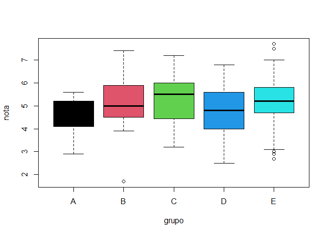

6 EJERCICIO
================

## R Markdown

This is an R Markdown document. Markdown is a simple formatting syntax
for authoring HTML, PDF, and MS Word documents. For more details on
using R Markdown see <http://rmarkdown.rstudio.com>.

When you click the **Knit** button a document will be generated that
includes both content as well as the output of any embedded R code
chunks within the document. You can embed an R code chunk like this:

``` r
summary(cars)
```

    ##      speed           dist       
    ##  Min.   : 4.0   Min.   :  2.00  
    ##  1st Qu.:12.0   1st Qu.: 26.00  
    ##  Median :15.0   Median : 36.00  
    ##  Mean   :15.4   Mean   : 42.98  
    ##  3rd Qu.:19.0   3rd Qu.: 56.00  
    ##  Max.   :25.0   Max.   :120.00

## Including Plots

You can also embed plots, for example:

<!-- -->

Note that the `echo = FALSE` parameter was added to the code chunk to
prevent printing of the R code that generated the plot.

***2.Realizar las siguientes sumas***

a . 1 + 2 + 3 + ……. + 1000

``` r
suma01 <- c(0:1000)
sum(suma01)
```

    ## [1] 500500

b . 1 + 2 + 4 + 8 + 16 + ….. + 1024

``` r
i <- NULL; aux <- NULL; r <- NULL
for (i in 0:10) {
  aux <- 2^i; r <- c(r, aux)}
sum(r)
```

    ## [1] 2047

***3.El vector grupo representa el grupo al que pertenece una serie de
alumnos***

a . ¿Cuántos elementos tiene?

*primero cargamos el archivo*

``` r
load("ei1012-1516-la-s1-datos.Rdata")
```

*convertimos a data frame*

``` r
dfclase <- data.frame(grupo, nota)
head(dfclase)
```

    ##   grupo nota
    ## 1     B  4.9
    ## 2     A  5.4
    ## 3     E  5.2
    ## 4     D  6.8
    ## 5     B  5.0
    ## 6     D  6.2

*obeservamos la cantidad de elementos que tiene con length*

``` r
length(dfclase$grupo)
```

    ## [1] 192

b . ¿En que posiciones del vector está la letra “A”?

*Obervamos la posición con la función “which”*

``` r
which(dfclase$grupo == "A")
```

    ##  [1]   2   8  17  21  28  84 101 108 111 115 123 136 190 192

***4. El vector nota representa la nota de un examen de los alumnos que
están en los grupos del vector grupo.***

a . ¿Cuanto suman todas las notas?

``` r
sum(dfclase$nota)
```

    ## [1] 962

b . ¿Cual es la media aritmética de todas las notas?

``` r
mean(dfclase$nota)
```

    ## [1] 5.010417

c . ¿En qué posiciones están las notas mayores de 7.0?

``` r
which(dfclase$nota > 7)
```

    ## [1]  81 103 120 151

d . Visualiza las notas ordenadas de mayor a menor

``` r
Notdec <- sort(dfclase$nota,decreasing = TRUE)
head(Notdec)
```

    ## [1] 7.7 7.5 7.4 7.2 7.0 6.9

e . ¿En qué posición está la nota máxima?

``` r
which.max(dfclase$nota)
```

    ## [1] 120

***5. A partir de los vectores grupo y nota definidos.***

a . Suma las notas de los 10 primeros alumnos del vector

``` r
notas10p <- dfclase$nota[1:10]
sum(notas10p)
```

    ## [1] 51.8

b . ¿Cuántos alumnos hay del grupo C?

``` r
grupoc <- dplyr::filter(dfclase, dfclase$grupo == "C")
length(grupoc$grupo)
```

    ## [1] 39

c . ¿Cuántos alumnos han aprobado?

``` r
aprobados <- dplyr::filter(dfclase, dfclase$nota > 10.5)
length(aprobados$nota)
```

    ## [1] 0

***6. Calcula el percentil 66 de las notas de todos los alumnos, y
también de los alumnos del grupo C.***

1.  Percentil de todos los alumnos

<!-- end list -->

``` r
percentil <- quantile(dfclase$nota, 66/100)
percentil
```

    ## 66% 
    ## 5.5

2.  Percentil de todos los alumnos del grupo C

<!-- end list -->

``` r
per66C <- quantile(grupoc$nota, 66/100)
per66C
```

    ##   66% 
    ## 5.808

***7. Un alumno tiene una nota de 4.9. ¿Qué porcentaje, del total de
alumnos, tiene una nota menor o igual que la suya? ¿Y qué porcentaje
tiene una nota mayor o igual que la suya?***

a . porcentaje de alummnos que tiene nota menor o igual a 4.9

``` r
menor4.9 <- dplyr::filter(dfclase, dfclase$nota <= 4.9)
(length(menor4.9$nota)/length(dfclase$nota))*100
```

    ## [1] 46.875

b . porcentaje de alummnos que tiene nota mayor o igual a 4.9

``` r
mayor4.9 <- dplyr::filter(dfclase, dfclase$nota >= 4.9)
(length(mayor4.9$nota)/length(dfclase$nota))*100
```

    ## [1] 56.25

***8. Realiza el gráfico de diagramas de caja de las notas de cada
grupo, para poder comparar el nivel de cada uno de ellos.***

``` r
boxplot(`nota` ~ `grupo`, dfclase, col = palette(rainbow(2)))
```

<!-- -->
